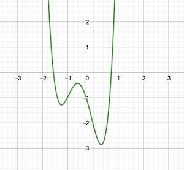

# CvxPy tutorial

## Linear programming

For a two-variable problem with two constraints, see [lesson1.py](src/cvxpytut/lesson1.py).

## Minimize convex and concave functions

### Second-degree polynomial

For a second-degree polynomial without constraints, see [lesson2.py](src/cvxpytut/lesson2.py).

### Fourth-degree polynomial

For a fourth-degree polynomial without constraints, see [lesson3.py](src/cvxpytut/lesson3.py).

Even though the package name "cvxpy" implies convex problems, it can also find the
minimum of concave functions like this fourth-degree polynomial:

```
f(x) = 4x^4 + 8x^3 + x^2 - 4x - 2
```


